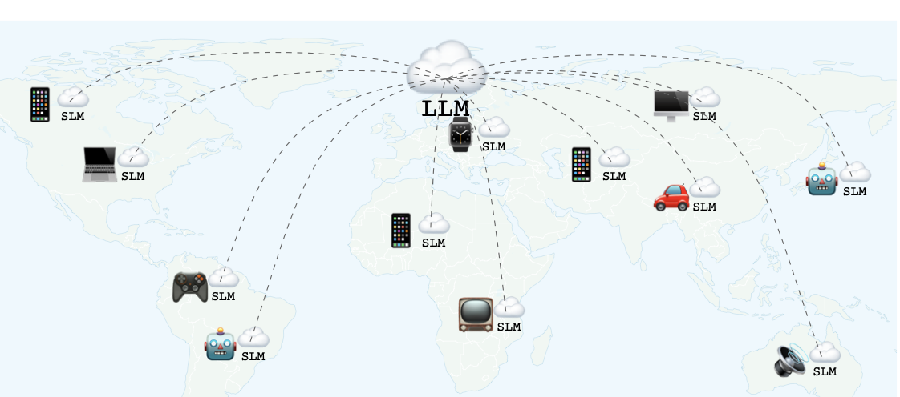
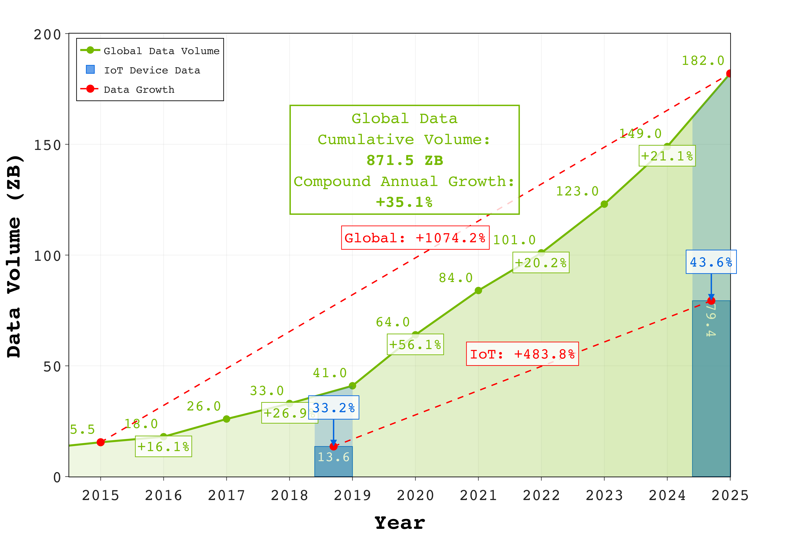
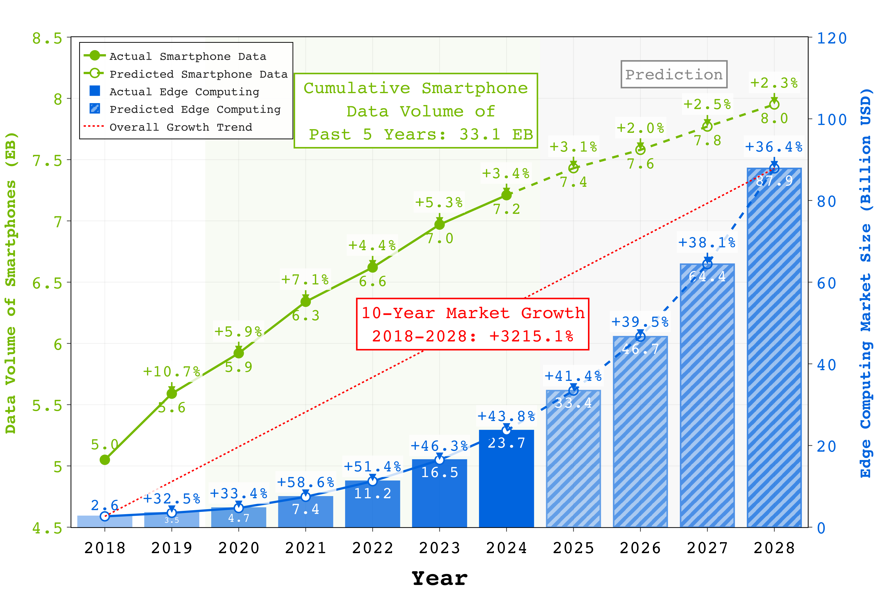
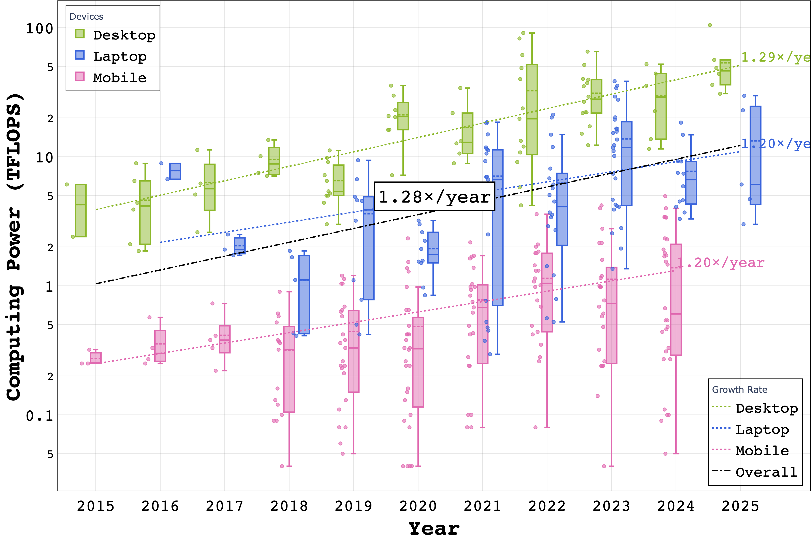
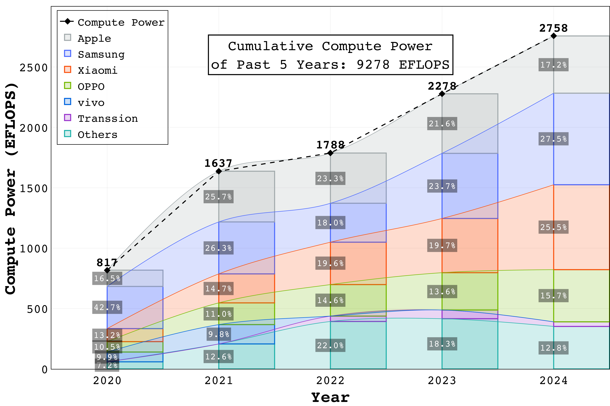

# Will LLMs Scaling Hit the Wall? Breaking Barriers with Distributed Resources on Massive Edge Devices

<div align="center">
<!-- <div align="center">
<p><em>Overview of our proposed distributed edge computing framework for LLM training and inference.</em></p>
</div> -->

[](https://arxiv.org/abs/xxx.xxxx)
[](https://github.com/tao-shen/Distributed-LLM-Edges)
[](https://example.com/project)


</div>

## Updates & News

- [03/2025] 📝 Our paper is submitted (on hold) on arXiv.

## 🎯 TL;DR

Neural scaling laws show that model performance improves with increased data and compute, but this trajectory faces critical challenges:

- **Data Wall**: High-quality public text data is becoming scarce, with potential exhaustion by 2028
- **Compute Wall**: AI training demands growing at 13.4× annually since 2022, dominated by tech giants
- **Solution**: We propose leveraging distributed edge devices, revealing that:
  - Global edge data volume will reach 182 ZB by 2025
  - Collective smartphone computing power exceeds 2,758 EFLOPS
  - Just 60,723 edge devices could train a DeepSeek-v3 scale model in one week

## 📊 Key Findings

### Data Resources

<div class="row" align="center">
<table>
<tr>
<td width="33%">

<p><em>IoT Data Contribution Analysis: Growing from 33.2% to 43.6% of Global Data Volume</em></p>
</td>
<td width="33%">

<p><em>Data Growth Trends in Edge Devices and Smartphones</em></p>
</td>
</tr>
</table>
</div>

- Global data volume projection: 182 ZB by 2025
  - IoT device contribution: 13.6 ZB (2019) → 79.4 ZB (2025)
  - Smartphone data growth: 5 EB (2018) → 8 EB (2028)
  - 5-year accumulated smartphone data: ~33.1 EB (pre-2025)

### Computing Power

<div class="row" align="center">
<table>
<tr>
<td width="33%">

<p><em>Edge Computing Power Growth Trend</em></p>
</td>
<td width="33%">

<p><em>Smartphone Computing Power Evolution: Reaching 2,758 EFLOPS by 2024</em></p>
</td>
</tr>
</table>
</div>

- Smartphone collective computing power:
  - 2020: 817 EFLOPS
  - 2024: 2,758 EFLOPS
  - 5-year cumulative: 9,278 EFLOPS
- Performance comparison:
  - Single flagship device: >2 TFLOPS
  - 30 smartphones ≈ 1 H100 GPU (59.30 TFLOPS)

## 🔍 Method

### Technical Approaches

1. **Small Language Models at Edges**
   - Deploying compact language models on edge devices
   - Model compression, knowledge distillation, and quantization
   - Reduces computational and memory requirements
   - Maintains acceptable performance

2. **Collaborative Inference**
   - Distributing inference across multiple devices
   - Enables more complex models than possible on individual devices
   - Maintains low latency and reduces bandwidth requirements
   - No single device handles entire computational load

3. **Collaborative Training**
   - Federated learning across distributed devices without requiring data to leave device
   - Preserves privacy while leveraging collective computational power
   - Reduces inter-node communication costs
   - Novel approaches for varying computational capabilities

## 🌟 Societal Impact

### AI Democratization
- Creates more inclusive environment for diverse participants
- Reduces dependence on major tech companies
- Significantly lowers barriers to AI development participation
- Enables smaller organizations, academic institutions, and individual developers

### Privacy and Data Ownership
- Data remains on user devices, reducing privacy risks
- Gives users greater control over their data
- Addresses concerns with stringent global privacy regulations

### Environmental Sustainability
- Utilizes idle computing capacity of existing devices
- Reduces energy consumption and need for dedicated data centers
- Leverages billions of devices already in operation
- Lowers carbon footprint associated with AI training infrastructure

## 🔮 Future Work and Outlook

Looking ahead, we anticipate:

- Continuous enhancement of edge device hardware capabilities
- More efficient distributed learning algorithms that minimize communication overhead
- Specialized small language model architectures optimized for edge deployment
- Advanced frameworks supporting secure, privacy-preserving collaborative learning

The distributed capacity of edge devices will foster a democratized AI ecosystem where developers worldwide can participate in training and applying large language models, addressing broader societal needs and unlocking new possibilities for AI innovation.

## 📖 Citation

```bibtex
@inproceedings{shen2025will,
  title={Will LLMs Scaling Hit the Wall? Breaking Barriers with Distributed Resources on Massive Edge Devices},
  author={Shen, Tao and Zhu, Didi and Zhao, Ziyu and Wu, Chao and Wu, Fei},
  booktitle={Arxiv},
  year={2025}
}
```

## 📄 License

This project is licensed under the MIT License. See [LICENSE](LICENSE) file for details.

## 🙏 Acknowledgments

We thank our colleagues and the research community for their valuable feedback and support.
