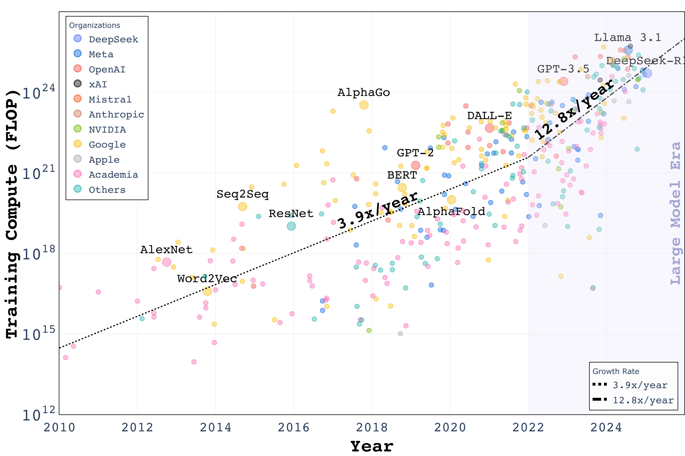

# Will LLMs Scaling Hit the Wall? Breaking Barriers with Distributed Resources on Massive Edge Devices

<div align="center">
<!-- <div align="center">
<p><em>Overview of our proposed distributed edge computing framework for LLM training and inference.</em></p>
</div> -->


[](https://arxiv.org/abs/xxx.xxxx)
[](https://github.com/tao-shen/Distributed-LLM-Edges)
[](https://example.com/project)


</div>


## Updates & News
- [03/2025] 📝 Our paper is available on arXiv

## 🎯 TL;DR

Neural scaling laws show that model performance improves with increased data and compute, but this trajectory faces critical challenges:

- **Data Wall**: High-quality public text data is becoming scarce, with potential exhaustion by 2028
- **Compute Wall**: AI training demands growing at 13.4× annually since 2022, dominated by tech giants
- **Solution**: We propose leveraging distributed edge devices, revealing that:
  - Global edge data volume will reach 182 ZB by 2025
  - Collective smartphone computing power exceeds 2,758 EFLOPS
  - Just 60,723 edge devices could train a DeepSeek-v3 scale model in one week

## 📊 Key Findings

### Data Resources
<div class="row" align="center">
<table>
<tr>
<td width="50%">

<p><em>IoT Data Contribution Analysis: Growing from 33.2% to 43.6% of Global Data Volume</em></p>
</td>
<td width="50%">

<p><em>Data Growth Trends in Edge Devices and Smartphones</em></p>
</td>
</tr>
</table>
</div>

- Global data volume projection: 182 ZB by 2025
  - IoT device contribution: 13.6 ZB (2019) → 79.4 ZB (2025)
  - Smartphone data growth: 5 EB (2018) → 8 EB (2028)
  - 5-year accumulated smartphone data: ~33.1 EB (pre-2025)

### Computing Power
<div class="row" align="center">
<table>
<tr>
<td width="50%">

<p><em>AI Computing Demand Growth Trend: 13.4× Annual Growth Since 2022</em></p>
</td>
<td width="50%">

<p><em>Smartphone Computing Power Evolution: Reaching 2,758 EFLOPS by 2024</em></p>
</td>
</tr>
</table>
</div>

- Smartphone collective computing power:
  - 2020: 817 EFLOPS
  - 2024: 2,758 EFLOPS
  - 5-year cumulative: 9,278 EFLOPS
- Performance comparison:
  - Single flagship device: >2 TFLOPS
  - 30 smartphones ≈ 1 H100 GPU (59.30 TFLOPS)

## 🔍 Method

### Framework Overview
Our approach consists of three main components:

1. **Edge Model Deployment**
   - Model compression techniques
   - Knowledge distillation
   - Quantization optimization
   - Resource-aware deployment

2. **Collaborative Inference**
   - Load distribution algorithms
   - Latency optimization
   - Dynamic resource allocation
   - Fault tolerance mechanisms

3. **Collaborative Training**
   - Federated learning protocols
   - Privacy-preserving mechanisms
   - Communication efficiency
   - Convergence guarantees

## 🌟 Societal Impact

### AI Democratization
- Reduced entry barriers
- Broader participation
- Decentralized innovation

### Privacy and Security
- Enhanced data privacy
- Local data ownership
- Reduced centralization

### Environmental Benefits
- Resource efficiency
- Data center reduction
- Carbon footprint decrease

## 🔮 Future Work

1. **Scaling Optimization**
   - Communication protocols
   - Resource allocation
   - Compression techniques

2. **Privacy Enhancement**
   - Security guarantees
   - Privacy mechanisms
   - Attack prevention

3. **Performance Improvement**
   - Architecture optimization
   - Training efficiency
   - Quality assurance


## 📖 Citation

```bibtex
@inproceedings{shen2025will,
  title={Will LLMs Scaling Hit the Wall? Breaking Barriers with Distributed Resources on Massive Edge Devices},
  author={Shen, Tao and Zhu, Didi and Zhao, Ziyu and Wu, Chao and Wu, Fei},
  booktitle={Arxiv},
  year={2025}
}
```


## 📄 License

This project is licensed under the MIT License. See [LICENSE](LICENSE) file for details.

## 🙏 Acknowledgments

We thank our colleagues and the research community for their valuable feedback and support.
